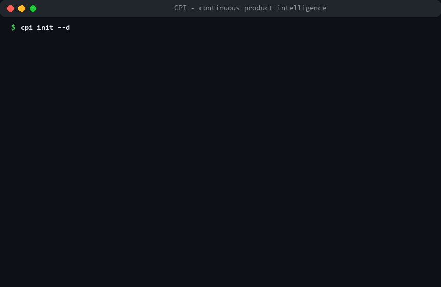

# CPI — Continuous Product Intelligence

CPI watches the outside world for your product — new research, competitor moves, industry
news, community discussion, funding activity — and turns what it finds into a short, ranked
list of ideas worth a look. Each idea comes with its evidence, pros and cons argued equally
hard, and a small suggested next step (days of work, not months).

**How it stays relevant to *your* product:** you describe the product once in a plain YAML
file (`context/pcm.yaml`) — what it does, who it's for, what you will never build. Everything
is filtered and scored against that description. The code knows nothing about any particular
product or industry, so the same pipeline works for a database tool, a trading system, or a
bakery chain: change the file, not the code.

**Who does what:** the AI reads everything and makes the first pass — collecting, filtering,
drafting scores. You make every call that matters: adjusting scores, auditing what got
filtered out, and deciding what to pursue, park, or kill. No decision is automated.

**What it takes:** one sitting from install to your first ranked brief — describe your
product in one file, then `cpi run`. After that, the whole routine is a monthly run plus a
short review. A full cycle has cost well under $1 in API usage at pilot volume (keyless demo
mode included if you just want to look around).



Read more: [White Paper](docs/white-paper.md) (the framework) ·
[Technical Paper](docs/technical-paper.md) (this implementation) ·
[Getting Started](docs/getting-started.md) · [PCM Authoring Guide](docs/pcm-authoring.md)

## Setup

```bash
git clone https://github.com/rn-tigey/cpi.git && cd cpi
pip install -e ".[dev]"

# LLM access:
#   export ANTHROPIC_API_KEY=sk-ant-...        (Windows: $env:ANTHROPIC_API_KEY = "sk-ant-...")
# Keyless / offline demo:
#   export CPI_DRY_RUN=1                        (deterministic canned LLM outputs)
```

Windows PowerShell note: `cpi` is a built-in PowerShell alias for `Copy-Item`, which shadows
this CLI. Either call `cpi.exe`, or remove the alias for your session with `Remove-Item Alias:cpi`
(add it to your PowerShell profile to make that permanent).

Models used: `claude-haiku-4-5` for volume tasks (summaries, triage), `claude-opus-4-8` for
judgment tasks (scoring, briefs, calibration). The per-task model map lives in `cpi/llm.py` —
edit it there to use different models. All calls go through that one wrapper; token usage is
logged to `data/llm_usage.jsonl` (see totals in `cpi status`).

## The six stages → commands

| Stage | What happens | Command | Cadence |
|---|---|---|---|
| 0 Draft | Bootstrap the PCM from existing artifacts | `cpi draft-pcm --docs <prds> --repo <repo>` | once |
| 1 Ground | Maintain the PCM (the lens); generate search criteria | edit `context/pcm.yaml`, then `cpi ground` | monthly review |
| 2 Scan | Collect + normalize signals | `cpi scan --source arxiv,hn` / `...crossref,rss` / `...funding` | daily / weekly / monthly |
| 3 Filter | LLM triage: advance/park/discard | `cpi triage` (+ `--rescore-parked` monthly) | daily-weekly |
| 3b Audit | Human spot-check of discards | `cpi spot-check` | weekly |
| 4 Assess | Cluster → draft scores → human review | `cpi cluster && cpi score && cpi review-scores` | monthly |
| 5 Recommend | Ranked Idea Brief (top ≤5) | `cpi brief` then `cpi decide <id> fund\|park\|kill` | monthly |
| 6 Learn | Calibration: few-shots, PCM & weight proposals | `cpi calibrate [--missed "..."]` | quarterly |

`cpi status` shows counts per stage at any time, plus a per-source health table that warns
when a configured source has stopped producing signals (dead feed, drifted queries).

Cost and noise controls: set `require_theme_hint: true` on a noisy feed (or the hn section)
to skip off-theme items before they cost a triage call; set `expand_links: true` on
digest/roundup feeds to also collect the primary sources they link to; tune idea granularity
with `cpi cluster --threshold`. Quarterly, `cpi calibrate` includes a per-source scorecard
and flags sources that never produce advanced signals.

The cadences above are recommendations, not constraints — run any stage as often as fits your
team. `cpi brief --month` accepts any period label (e.g. `2026-W30` for a weekly brief); each
label gets its own brief file, and ideas already delivered under an earlier label are
excluded automatically.

## Quickstart

```bash
# 1. Create a working home for your product
cpi init --dest ~/cpi-myproduct
export CPI_HOME=~/cpi-myproduct        # Windows: $env:CPI_HOME = "..."

# 2. Ground: author your PCM (see docs/pcm-authoring.md)
#    edit $CPI_HOME/context/pcm.yaml and $CPI_HOME/config/sources.yaml
#    Have PRDs or a product repo already? Draft it instead of starting blank:
#      cpi draft-pcm --docs ./my-prds --repo ./my-product
#    then answer the OPEN QUESTION comments in the generated pcm.yaml.

# 3. Let CPI translate the PCM into per-source search queries
cpi ground        # writes config/search.yaml - review and edit it

# 4. Run a full cycle in one shot - scan -> triage -> cluster -> score -> brief
cpi run
```

`cpi run` does the entire automated half in one command — enough to get your first ranked
brief in one sitting. The per-stage commands below are for scheduled operation and for the
human half of the loop (spot-checks, score review, decisions), which no command automates
on purpose.

### Search criteria (`cpi ground`)

You describe the product once in the PCM; `cpi ground` writes the searches. It derives a
**standard set** mechanically (competitor names from `competitive_set`) and asks the judgment
model to translate each watch theme into the vocabulary of each channel — academic phrasing
for arXiv, developer phrasing for Hacker News, product-category phrasing for trade press.
The output is a plain, editable `config/search.yaml`; you review it like any other config.
Scanners fall back to the raw PCM theme keywords when the file is absent. Re-run
`cpi ground --force` after significant PCM changes.

## Scheduling

**cron:**
```cron
0 7 * * *   CPI_HOME=/path/to/home cpi scan --source arxiv,hn && cpi triage
0 8 * * 0   CPI_HOME=/path/to/home cpi scan --source crossref,rss
0 8 1 * *   CPI_HOME=/path/to/home cpi scan --source funding && cpi triage --rescore-parked && cpi cluster && cpi score
```

**Windows (Task Scheduler):**
```powershell
schtasks /Create /TN "CPI daily scan"    /SC DAILY  /ST 07:00 /TR "cmd /c set CPI_HOME=C:\path\to\home&& cpi scan --source arxiv,hn && cpi triage"
schtasks /Create /TN "CPI weekly rollup" /SC WEEKLY /D SUN /ST 08:00 /TR "cmd /c set CPI_HOME=C:\path\to\home&& cpi scan --source rss"
schtasks /Create /TN "CPI monthly"       /SC MONTHLY /D 1  /ST 08:00 /TR "cmd /c set CPI_HOME=C:\path\to\home&& cpi scan --source funding && cpi triage --rescore-parked && cpi cluster && cpi score"
```

Spot-checks, `review-scores`, `brief`, `decide`, and `calibrate` are deliberately **manual** —
they are the human half of the hybrid.

## From day one to a routine

**Day 1 — your first brief.** Describe the product in `context/pcm.yaml` (or draft it with
`cpi draft-pcm`), run `cpi ground`, then `cpi run`. You'll be reading a ranked brief the same
sitting. Expect it to be rough — it's built from a single scan and a filter you haven't
corrected yet. Judge the potential, not the polish.

**Monthly — the working rhythm.** Run a cycle (`cpi run`), adjust the drafted scores
(`cpi review-scores`), and record a fund/park/kill decision for each idea (`cpi decide`).
Between cycles, two optional habits make the briefs noticeably better: automate the daily
scan+triage (see Scheduling) so signals accumulate instead of arriving in one batch, and run
an occasional `cpi spot-check` so someone audits what the filter throws away.

**Quarterly — let it learn.** `cpi calibrate` turns your score corrections, spot-check
reversals, and decisions into sharper triage and better-calibrated drafts. This is when the
loop starts compounding — each cycle slightly better than the last.

## Layout

Repository:

```
cpi/               the Python package (cli, llm, models, pcm, store, scanners/, pipeline/)
cpi/templates/     pristine templates shipped in the wheel: PCM template, default
                   config (sources.yaml, weights.yaml), LLM prompt templates
tests/             pytest suite (network mocked, LLM dry-run)
docs/              white paper, technical paper, guides
```

A CPI home (created by `cpi init`, one per product):

```
context/           pcm.yaml (yours), pcm.template.yaml, pcm_changelog.md
config/            sources.yaml, weights.yaml, search.yaml (from `cpi ground`)
prompts/           editable LLM prompt templates (no code changes needed)
data/              signals/, triage/, ideas/, calibration/, scan_log.jsonl, ...
briefs/            <label>-idea-brief.md
```

## Tests

Keyless and offline — `tests/conftest.py` forces `CPI_DRY_RUN=1`:

```bash
pytest
```

## License

MIT — see [LICENSE](LICENSE).
